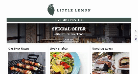

This project is for Django

## About

This project has two directory as section. One is for Python cording. Another is for Django.
There are some project in the section.

## django_exercise / Little Lemon Restaurant Web Application

Developing Little lemon restaurant Web Application is final task for Django course.
Here is how to watch it.

```
cd django exercise/
source myenv/bin/activate
cd littlelemon
python3 manage.py runserver
```

website
`http://127.0.0.1:8000/`

admin panel
`http://127.0.0.1:8000/admin/`

<!-- 参照 -->



## django_api / Little Lemon Restaurant Web Application
Django REST Framework is used for this project. You can use API preview screen 

```
cd django_api/restaurant-menu-api-using-serialization
pipenv shell
python3 manage.py runserver
```

API preview
`http://127.0.0.1:8000/book-menu`

API detail
`http://127.0.0.1:8000/book-menu/1`


https://zenn.dev/articles/d803fd7094fbad/edit

